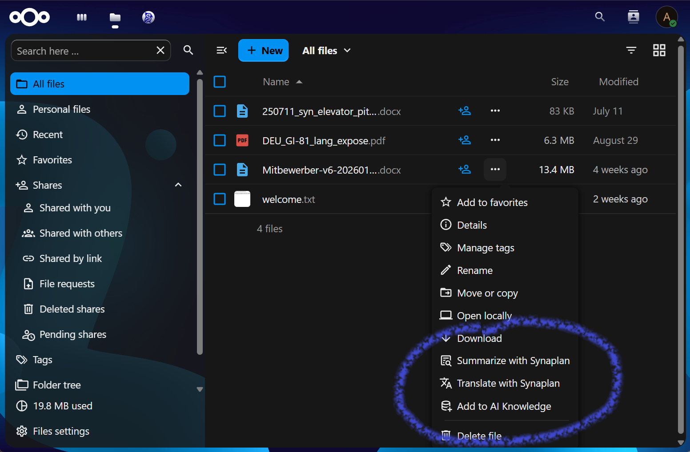

# Synaplan Integration for Nextcloud



AI-powered document summarization, translation, knowledge base, and research chat — directly in Nextcloud.

## Features

- **Summarize** — Generate document summaries from the file context menu (bullet points, paragraph, or abstractive; adjustable length and output language)
- **Translate** — Translate files to 12 languages via the file context menu
- **Add to Knowledge** — Upload files to the Synaplan AI knowledge base for RAG-powered search and chat, with group management
- **Research Chat** — Full-page AI assistant with knowledge group selection and LLM model picker, accessible from the top navigation bar

### Supported File Types

| Type | Formats |
|------|---------|
| Text | TXT, Markdown, CSV, HTML, XML, RTF, JSON |
| Documents | PDF, DOCX, DOC, ODT |
| Spreadsheets | XLSX, XLS, ODS |
| Presentations | PPTX, PPT, ODP |

Binary formats (PDF, Office, OpenDocument) are processed via Synaplan's built-in Tika text extraction.

## Requirements

- Nextcloud 30–34
- PHP 8.2+
- A running [Synaplan](https://synaplan.com) instance with a valid API key

## Installation

### From the Nextcloud App Store (recommended)

1. Go to your Nextcloud instance → **Apps**
2. Search for **Synaplan Integration**
3. Click **Download and enable**

### From a Release Tarball

```bash
# Download the latest release
wget https://github.com/metadist/synaplan-nextcloud/releases/latest/download/synaplan_integration.tar.gz

# Extract into Nextcloud's custom_apps directory
tar -xzf synaplan_integration.tar.gz -C /path/to/nextcloud/custom_apps/

# Enable the app
php /path/to/nextcloud/occ app:enable synaplan_integration
```

### From Source (Development)

```bash
git clone https://github.com/metadist/synaplan-nextcloud.git
cd synaplan-nextcloud

composer install
npm install
npm run build

# Symlink into Nextcloud
ln -s "$(pwd)" /path/to/nextcloud/custom_apps/synaplan_integration

php /path/to/nextcloud/occ app:enable synaplan_integration
```

## Configuration

1. Go to **Admin Settings** → **Synaplan Integration**
2. Enter your Synaplan instance URL (e.g., `https://synaplan.example.com`)
3. Enter your Synaplan API key
4. Click **Test connection** to verify

## Development

```bash
composer install          # PHP dependencies
npm install               # JS dependencies

make lint                 # Run all linters (PHP + JS + Prettier)
make test                 # Run PHPUnit tests
make build                # Production frontend build
make help                 # Show all available commands

npm run dev               # Watch mode (auto-rebuild on changes)
```

## Release

```bash
make package              # Build unsigned tarball
make sign                 # Build + sign (requires certificate)
make appstore             # Build, sign, and show upload instructions
```

See `release-work/RELEASE-PLAN.md` for the full release process (gitignored, local only).

## License

Apache-2.0 — see [LICENSE](LICENSE).
